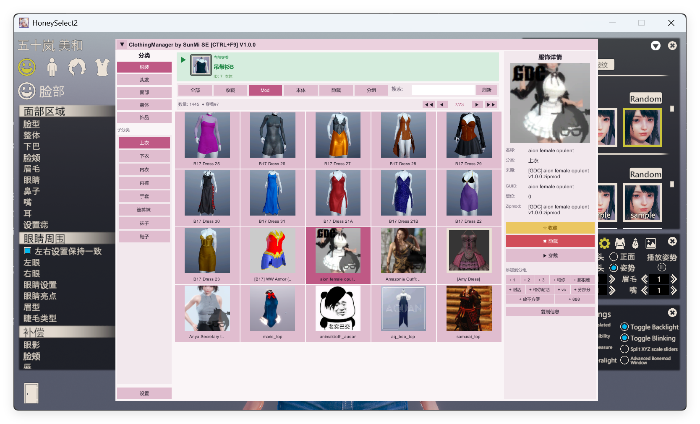

[中文](README.md) | [English](README_EN.md) | [日本語](README_JP.md)

---

# HS2 Clothing Manager

**HoneySelect2 DX 服飾管理プラグイン**

*すべての服を、すぐ手元に*

---

## ✨ 機能紹介

HS2 Clothing Manager は HoneySelect2 向けのフル機能服飾管理プラグインです。直感的なビジュアルインターフェースで、大量の服飾を簡単に閲覧、検索、お気に入り登録、着用、管理できます。

### 📦 主要機能

| 機能 | 説明 |
|:---|:---|
| 🗂️ **カテゴリ閲覧** | 服・髪・顔・ボディ・アクセサリの5大カテゴリで閲覧、各カテゴリに完全なサブカテゴリ付き |
| 🖼️ **サムネイルプレビュー** | グリッドレイアウトでサムネイル表示、一目で確認 |
| ⭐ **お気に入り** | ワンクリックでお気に入り登録、フィルターで即座にアクセス |
| 👁️ **非表示** | 不要なアイテムを非表示にしてリストをスッキリ |
| 📁 **カスタムグループ** | カスタムグループを作成、カテゴリをまたいだ整理が可能 |
| 🔍 **スマート検索** | 名前、GUID、Zipmod名で検索、Enterで即時更新 |
| 👗 **クイック着用** | キャラクターメーカー内でプラグインから直接着用 |
| 🎯 **現在着用中** | 選択中のカテゴリで現在着用中のアイテムをリアルタイム表示 |
| 📋 **情報コピー** | ワンクリックでアイテム詳細をクリップボードにコピー |

### 🎛️ カスタマイズ

| 設定 | 説明 |
|:---|:---|
| 🌐 **多言語** | 中文、English、日本語に対応 — 設定変更は再起動不要で即時反映 |
| 📄 **ページサイズ** | 1ページあたりの表示数をカスタマイズ（10〜60） |
| 🔅 **ウィンドウ透明度** | 非フォーカス時のウィンドウ透明度を調整（20%〜100%） |
| 📐 **ウィンドウサイズ** | ウィンドウの幅と高さを自由に調整 |

### ⌨️ ショートカット

- **CTRL + F9** — プラグインウィンドウの表示/非表示

---

## 📥 インストール

1. [BepInEx 5.x](https://github.com/BepInEx/BepInEx)、[KKAPI](https://github.com/IllusionMods/KKAPI)、[Sideloader](https://github.com/IllusionMods/Sideloader) がインストールされていることを確認
2. `HS2_ClothingManager.dll` を `BepInEx/plugins/` ディレクトリに配置
3. ゲームを起動 — キャラクターメーカーに入ると自動的に読み込まれます

---

## 🏷️ エディション

### SE エディション（公開版）

このリポジトリで公開しているのは **SE（Standard Edition）** で、すべてのユーザーに無料で提供されています。

| 機能 | SE 制限 |
|:---|:---|
| お気に入り | 最大100件 |
| 非表示アイテム | 最大100件 |
| カスタムグループ | 最大10グループ、グループ内に制限なし |

> SE に機能制限はありません — アップデートとバグ修正が提供され、日常使用には十分です。

### EX エディション（スポンサー版）

**EX（Exclusive Edition）** は XrmSeries のスポンサーに無料で提供され、すべての機能に制限がありません。

| 機能 | EX 制限 |
|:---|:---|
| お気に入り | ♾️ 無制限 |
| 非表示アイテム | ♾️ 無制限 |
| カスタムグループ | ♾️ 無制限 |

> EX に機能制限はありません — アップデートとバグ修正が提供され、数量制限もありません。

---

## 💬 このプロジェクトについて

私は **XrmSeries 3** の開発者です。
有料ユーザーにより良いツールとサービスを提供する義務があります。だからこそ、私のすべての努力は彼らのためだけにあります。私は HS2 をプレイしません。個人の興味や必要性からこれらのツールを作っているわけではありません。私の原動力は、私を支援してくれたユーザーからのみ来ています。

彼らが私を信じてくれたから、私は彼らのために作り続けます。

このプラグインは特別なものではありません。十分にテストしていないため、バグがあるかもしれませんし、不完全かもしれませんし、より良い代替品があるかもしれません — それでも、誰かの役に立てば幸いです。

スポンサー版は課金のためではありません。SE 版を公開するのは、より多くのユーザーに便利さを共有してもらうため — ささやかな善意です。EX 版が存在するのは、私を支援してくれた人たちが常に多くを得られるようにするためです。彼らが料金を支払ったからではなく、彼らの支援そのものが、私が創り続ける唯一の理由だからです。

できる限り、彼らのために、私の力の及ぶ範囲でより良い世界を作り続けたいと思います。

---

## 🔗 リンク

- 🌐 ドキュメント：[https://docs.xrmsoft.com](https://docs.xrmsoft.com)
- ❤️ 愛発電：[https://afdian.com/a/xrmpc](https://afdian.com/a/xrmpc)

---

## ⚖️ ライセンス

全著作権留保。作者の許可なく、再配布、逆コンパイル、改変、または商用利用を禁じます。
